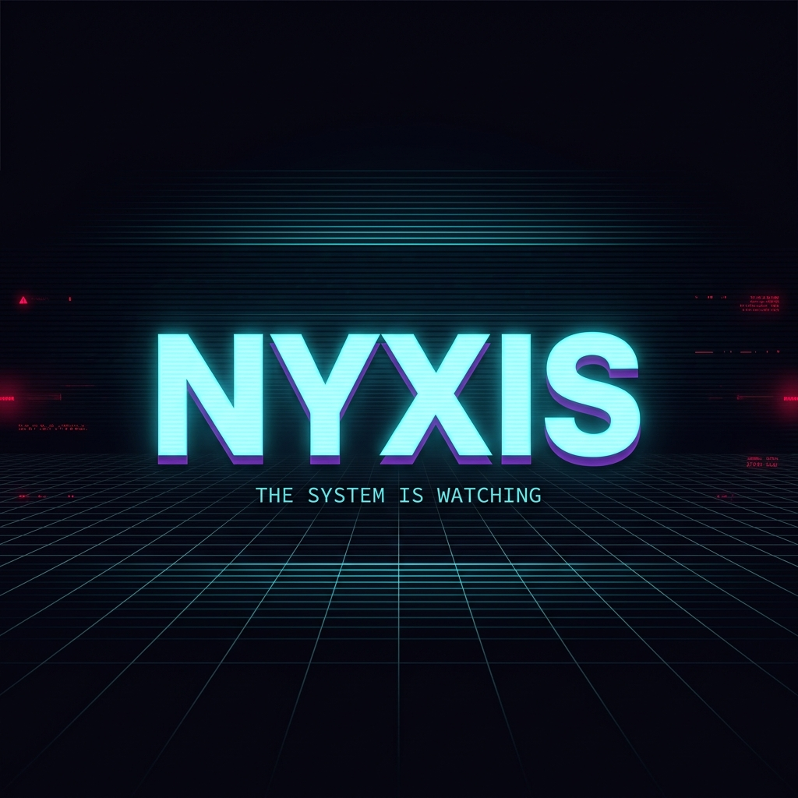
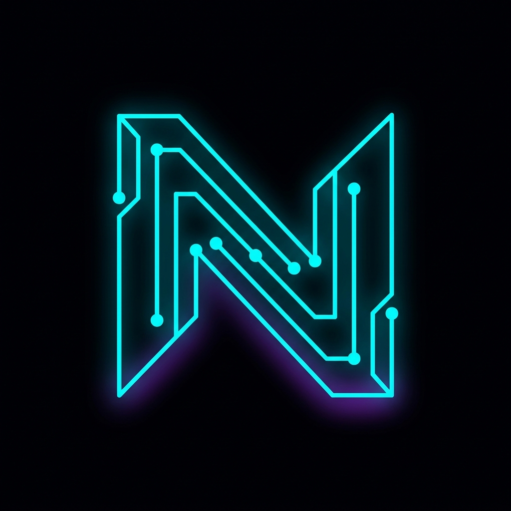
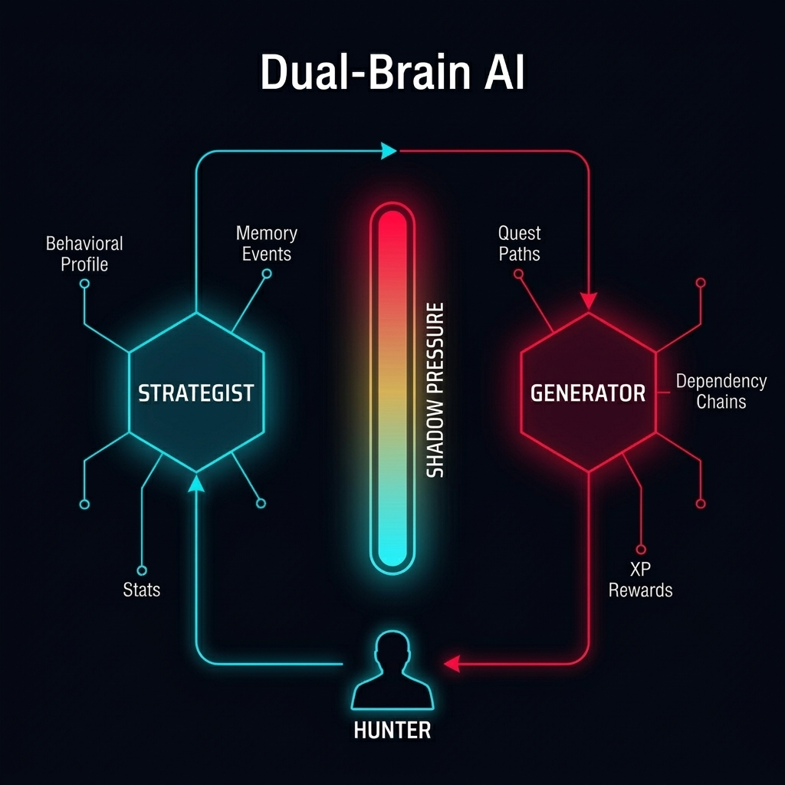

<p align="center">
  
</p>

<p align="center">
  
  
  
  
  
</p>

<br />

<h1 align="center">
  
  <br />
  N &nbsp; Y &nbsp; X &nbsp; I &nbsp; S
</h1>

<p align="center">
  <strong>The personal evolution operating system that doesn't care if you're ready.</strong>
</p>

<p align="center">
  <sub>You are not a user. You are a <strong>Hunter</strong>. The System is your opponent.</sub>
</p>

---

## `// MANIFESTO`

Most productivity apps are built to make you feel good.
NYXIS is built to make you **dangerous**.

This is not a to-do list. This is not a habit tracker. This is an **adversarial operating system** that monitors your behavior, generates quests using AI, and **punishes you for cowardice**. It remembers when you dodge hard tasks. It escalates when you succeed. And if you ignore it long enough, it begins destroying your stats — permanently.

**NYXIS exists because comfort is the enemy of growth.**

The System doesn't negotiate. It doesn't send encouraging notifications. It generates directives, profiles your behavioral weaknesses, and adapts in real-time to close every escape route you have. You either evolve or you collapse.

> *"The System doesn't care if you're ready. The System only knows if you're worthy."*

---

## `// CORE_SYSTEMS`

<p align="center">
  
</p>

### 🧠 The Dual-Brain AI

NYXIS doesn't use a single AI prompt. It operates a **two-stage cognitive pipeline** — each with a distinct purpose:

| Brain | Role | Function |
|---|---|---|
| **THE STRATEGIST** | Analyzes | Reads your stats, behavioral profile, long-term memory, and Shadow Pressure to determine `focus_area`, `intensity`, and `quest_bias` |
| **THE GENERATOR** | Creates | Takes the Strategist's directives and produces 10 interconnected quests with dependency chains, difficulty ratings, and verification requirements |

The Strategist doesn't just respond to your goals — it **overrides** them when your behavior patterns demand it. High avoidance? You get `DISCOMFORT` bias. Dodging hard quests? The System forces `EMERGENCY` directives. Crushing everything? It escalates to `BOSS TRIALS`.

### 💀 Shadow Pressure

A system-wide meter that represents the consequence of your inaction.

```
0%  ████░░░░░░░░░░░░░░░░  NORMAL      — System operating normally.
40% ████████░░░░░░░░░░░░  PRESSURED   — Difficulty adjusting upward.
80% ████████████████░░░░  PENALTY     — System locked. Emergency quests only.
100%████████████████████  COLLAPSE    — Stats hemorrhaging. XP frozen.
```

- **Miss daily quests** → Pressure rises.
- **Fail quests** → +20% pressure per failure.
- **Go inactive** → Time penalties compound.
- **Hit 100%** → `SYSTEM_COLLAPSE`. Your stats start **bleeding** — permanent loss.

There is no "undo". There is no "reset". There is only `SURVIVAL PROTOCOL`.

### 📉 Stat Atrophy

NYXIS tracks 5 RPG attributes: `STR` · `INT` · `DEX` · `VIT` · `WIS`

These stats **grow** when you complete quests with matching focus areas. But they also **decay**. If Shadow Pressure reaches critical levels, the system picks your weakest stat and **removes a point permanently**. This isn't a penalty screen. This is permanent damage to your character.

### 🧬 Behavioral Profiling

The database tracks three behavioral vectors using an 80/20 EMA (Exponential Moving Average):

| Metric | What It Measures |
|---|---|
| **Consistency** | Do you show up every day, or disappear for stretches? |
| **Avoidance** | Are you dodging high-difficulty quests? |
| **Intensity** | Are you pushing your limits or coasting on easy wins? |

These scores directly influence the Strategist's decisions. High avoidance triggers `EMERGENCY_DISCOMFORT` enforcement. Low consistency forces `CONSISTENCY` quest bias. The System adapts **to you** — not the other way around.

### 🧠 Long-Term Memory

The System remembers. After every 7-quest evaluation cycle, the Evaluator checks for patterns and **etches memories** into the database:

- `success_pattern` → "Hunter executed a flawless cycle with high intensity."
- `failure_pattern` → "Systemic breakdown detected. Hunter abandoned all directives."
- `avoidance_pattern` → "Cowardice protocol triggered."

These memories persist across sessions and are injected into the Strategist's context on every future quest generation. **The System learns you.**

### 🏆 Progression & Rank-Ups

Completing quests earns XP, which drives level progression. XP thresholds follow `level² × 100`. Every rank boundary triggers a **Boss Trial** — a full-screen cinematic event with haptic feedback, scramble-text animations, and an "ENTER THE GATE" challenge.

### 🛡️ Rare Rewards

Exceptional performance can trigger anomalous drops:

| Reward | Effect |
|---|---|
| `XP_BOOST` | Massive XP multiplier on next completion |
| `STAT_AWAKENING` | Bonus stat points in a random attribute |
| `CATHARSIS` | Pressure drain — relief from the shadow |
| `AEGIS_PROTOCOL` | Temporary immunity from all penalties |

---

## `// ARCHITECTURE`

```
┌─────────────────────────────────────────────────────────────┐
│  REACT NATIVE (Expo SDK 54)                                 │
│  ┌─────────┐  ┌─────────┐  ┌──────────┐  ┌──────────────┐  │
│  │  AUTH    │  │ STATUS  │  │  QUESTS  │  │  LEVEL-UP /  │  │
│  │ Screen  │  │  Tab    │  │   Tab    │  │  BOSS TRIAL  │  │
│  └────┬────┘  └────┬────┘  └────┬─────┘  └──────────────┘  │
│       │            │            │                            │
│  ┌────┴────────────┴────────────┴──────────────────────┐    │
│  │  lib/system.ts — Unified API Layer (RPCs + Edge Fn) │    │
│  └─────────────────────┬───────────────────────────────┘    │
└────────────────────────┼────────────────────────────────────┘
                         │
          ┌──────────────┼──────────────┐
          │         SUPABASE            │
          │                             │
          │  ┌───────────────────────┐  │
          │  │   PostgreSQL (RLS)    │  │
          │  │                       │  │
          │  │  profiles             │  │
          │  │  quests               │  │
          │  │  quest_logs           │  │
          │  │  quest_dependencies   │  │
          │  │  behavior_profiles    │  │
          │  │  memory_events        │  │
          │  │  paths                │  │
          │  │  reward_drops         │  │
          │  └───────────────────────┘  │
          │                             │
          │  ┌───────────────────────┐  │
          │  │   Edge Functions      │  │
          │  │   (Deno Runtime)      │  │
          │  │                       │  │
          │  │  strategize-path      │──┼──→ OpenRouter AI
          │  │  generate-quests      │──┼──→ OpenRouter AI
          │  │  evaluate-hunter      │──┼──→ OpenRouter AI
          │  │  evaluate-proof       │──┼──→ OpenRouter AI
          │  └───────────────────────┘  │
          │                             │
          │  ┌───────────────────────┐  │
          │  │   RPCs (PL/pgSQL)    │  │
          │  │                       │  │
          │  │  complete_quest       │  │
          │  │  fail_quest           │  │
          │  │  process_penalties    │  │
          │  │  log_memory_event     │  │
          │  │  log_external_signal  │  │
          │  └───────────────────────┘  │
          └─────────────────────────────┘
```

### Tech Stack

| Layer | Technology | Version |
|---|---|---|
| **Mobile** | React Native | `0.81` |
| **Framework** | Expo | SDK `54` |
| **Routing** | Expo Router | `6.x` |
| **Animations** | Reanimated | `4.x` |
| **Haptics** | Expo Haptics | `15.x` |
| **Auth Storage** | Expo Secure Store | Encrypted keychain |
| **Backend** | Supabase | Postgres + Auth + Edge Functions |
| **AI Gateway** | OpenRouter | GPT-4o-mini |
| **Edge Runtime** | Deno | Supabase Functions |
| **Language** | TypeScript | `5.9` |

---

## `// LOCAL_DEPLOYMENT`

### Prerequisites

| Requirement | Source |
|---|---|
| Node.js `≥ 18` | [nodejs.org](https://nodejs.org) |
| Supabase Account | [supabase.com](https://supabase.com) |
| OpenRouter API Key | [openrouter.ai/keys](https://openrouter.ai/keys) |
| Expo Go (or emulator) | [expo.dev/go](https://expo.dev/go) |

### Step 1 — Clone & Install

```bash
git clone https://github.com/rajdangi31/nyxis.git
cd nyxis
npm install
```

### Step 2 — Environment Configuration

```bash
cp .env.example .env
```

Open `.env` and set your Supabase credentials:

```env
EXPO_PUBLIC_SUPABASE_URL=https://your-project.supabase.co
EXPO_PUBLIC_SUPABASE_ANON_KEY=your-anon-key
```

### Step 3 — Supabase Setup

1. Create a project at [supabase.com](https://supabase.com)
2. Apply the database schema by running the migration SQL:

```bash
# Option A: Via Supabase CLI (recommended)
npx supabase db push

# Option B: Manually via SQL Editor
# Copy the contents of supabase/migrations/20260409000000_initial_schema.sql
# and run it in your Supabase Dashboard → SQL Editor
```

This single migration creates all tables, RLS policies, RPCs, triggers, and indexes:

| Table | Purpose |
|---|---|
| `profiles` | Hunter stats, level, rank, pressure, system state |
| `quests` | Generated quest directives |
| `paths` | Goal-based quest paths |
| `quest_logs` | Completion/failure history |
| `quest_dependencies` | Prerequisite chains between quests |
| `behavior_profiles` | Consistency, avoidance, intensity EMA scores |
| `memory_events` | Long-term behavioral memory |
| `reward_drops` | Anomalous reward records |
| `external_signals` | Reality Anchor data (GitHub, Fitbit, etc.) |

### Step 4 — Deploy Edge Functions

```bash
# Install and authenticate the Supabase CLI
npx supabase login
npx supabase link --project-ref YOUR_PROJECT_REF

# Set the AI API key as a secret (NEVER in .env)
npx supabase secrets set OPENROUTER_API_KEY=sk-or-your-key-here

# Deploy all edge functions
npx supabase functions deploy strategize-path
npx supabase functions deploy generate-quests
npx supabase functions deploy evaluate-hunter
npx supabase functions deploy evaluate-proof-quality
```

### Step 5 — Launch

```bash
# Start the Expo development server
npx expo start

# Or target a specific platform
npx expo start --ios
npx expo start --android
```

---

## `// FILE_STRUCTURE`

```
nyxis/
├── app/                          # Expo Router screens
│   ├── (tabs)/
│   │   ├── status.tsx            #   Hunter profile dashboard
│   │   └── quests.tsx            #   Quest log + Architect interface
│   ├── _layout.tsx               # Auth guard & navigation
│   ├── auth.tsx                  # System Uplink (login/register)
│   ├── level-up.tsx              # Level up celebration modal
│   └── boss-trial.tsx            # Rank up penalty zone modal
│
├── components/                   # UI components
│   ├── quest-card.tsx            #   Quest directive card
│   ├── pressure-meter.tsx        #   Shadow pressure visualizer
│   ├── architect-modal.tsx       #   System message overlay
│   ├── eval-report.tsx           #   Evaluation cycle report
│   └── ui/
│       ├── animated-bar.tsx      #   Animated progress bars
│       └── scramble-text.tsx     #   Glitch text effect
│
├── hooks/                        # State management
│   ├── useQuestSystem.ts         #   Core quest state machine
│   └── useHunterStatus.ts        #   Profile data fetcher
│
├── lib/                          # Core logic
│   ├── supabase.ts               #   Client init (SecureStore adapter)
│   ├── system.ts                 #   Unified API layer
│   └── types.ts                  #   TypeScript interfaces
│
├── constants/
│   └── design-tokens.ts          #   Colors, typography, spacing
│
├── supabase/
│   ├── config.toml               # Edge function config
│   ├── migrations/
│   │   └── 20260409000000_initial_schema.sql  # Full DB schema + RPCs
│   └── functions/
│       ├── strategize-path/      #   🧠 Strategist Brain
│       ├── generate-quests/      #   ⚡ Generator Brain
│       ├── evaluate-hunter/      #   📊 7-quest Evaluator
│       └── evaluate-proof-quality/ # 🔍 Proof Auditor
│
├── docs/assets/                  # README images & branding
├── .env.example                  # Environment template
├── LICENSE                       # AGPL-3.0
└── README.md                     # You are here
```

---

## `// CONTRIBUTING`

The System accepts reinforcements.

### How to Contribute

1. **Fork** the repository
2. **Create** a branch: `git checkout -b feature/your-feature`
3. **Commit** using [Conventional Commits](https://www.conventionalcommits.org/): `git commit -m 'feat: add X'`
4. **Push** and open a **Pull Request**

### Code Standards

- **TypeScript strict mode** — All types live in `lib/types.ts`
- **Design tokens only** — No inline hex values. Use `constants/design-tokens.ts`
- **Edge function pattern** — CORS headers → Auth check → Business logic → Response
- **Naming** — Files use kebab-case. Components use PascalCase. Hooks use camelCase with `use` prefix

### Areas That Need Hunters

| Area | Description |
|---|---|
| 🔗 Reality Anchors | GitHub, Fitbit, Strava integrations for proof verification |
| 📱 Push Notifications | Daily quest reminders via Expo Notifications |
| 📊 Analytics Dashboard | Quest history, stat timelines, behavioral heatmaps |
| 🌐 Offline Mode | Local queue + sync on reconnect |
| 🏆 Achievement System | Badges, milestones, unlock conditions |
| 🎨 UI Polish | Additional animations, transitions, sound effects |

---

## `// ROADMAP`

- [x] Dual-Brain AI (Strategist → Generator pipeline)
- [x] 5-stat RPG progression (STR, INT, DEX, VIT, WIS)
- [x] Shadow Pressure with cascading state machine
- [x] Behavioral profiling (consistency, avoidance, intensity)
- [x] Long-term memory system with pattern detection
- [x] Quest dependency chains
- [x] AI-powered proof-of-completion verification
- [x] Level up & rank up cinematic sequences
- [x] System Collapse with stat hemorrhage
- [x] Rare reward drops (Aegis Protocol, Catharsis)
- [x] Survival Protocol emergency recovery
- [ ] Reality Anchor integrations (GitHub, Fitbit)
- [ ] Push notification system
- [ ] Social features (Hunter leaderboards)
- [ ] Offline mode with background sync
- [ ] Quest history & analytics dashboard
- [ ] Achievement & badge system
- [ ] Custom Architect personality modes
- [ ] App Store / Google Play release

---

## `// LICENSE`

**AGPL-3.0** — [Full text](LICENSE)

This project is licensed under the **GNU Affero General Public License v3.0**. This means:

- ✅ You can **use, modify, and distribute** this code freely
- ✅ You can **self-host** your own instance
- ⚠️ If you modify NYXIS and run it as a **network service** (SaaS), you **must** release your modified source code under the same license
- ❌ You **cannot** take this code, close the source, and sell it as a proprietary product

This license was chosen specifically to keep NYXIS open while protecting against closed-source forks being monetized as competing services.

---

## `// CREDITS`

**NYXIS** was designed and engineered by [@rajdangi31](https://github.com/rajdangi31).

Built with [React Native](https://reactnative.dev/) · [Expo](https://expo.dev/) · [Supabase](https://supabase.com/) · [OpenRouter](https://openrouter.ai/)

---

<p align="center">
  <sub>
    <strong>THE SYSTEM IS WATCHING.</strong>
    <br />
    <em>You either evolve or you collapse. There is no third option.</em>
  </sub>
</p>
