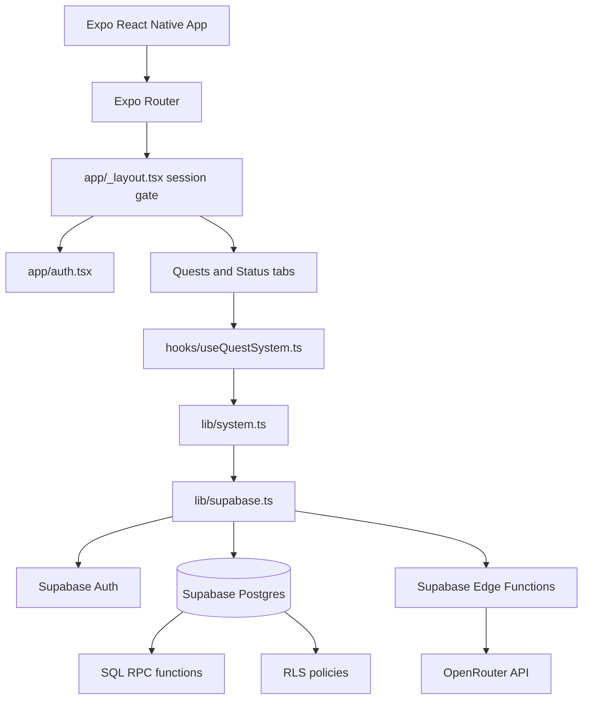
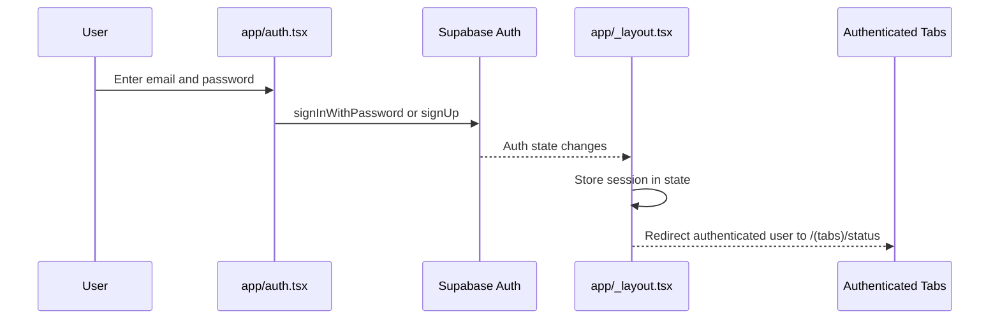
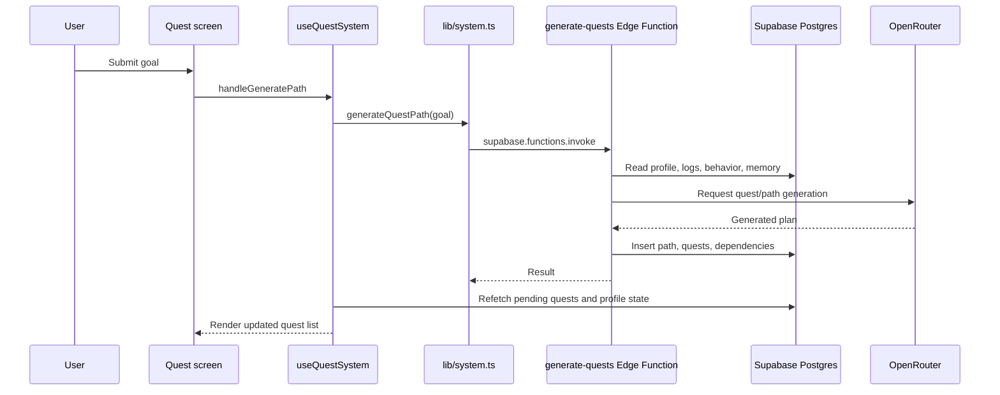
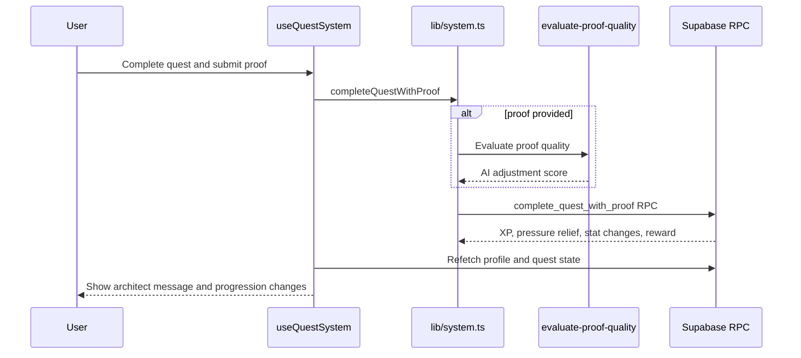

# NYXIS

## Overview
NYXIS is a React Native personal progression app built around quests, behavioral pressure, proof submission, stat progression, and AI-assisted path generation. Users authenticate with Supabase, define goals, receive generated quests, complete or fail those quests, and watch profile state change over time.

The project exists as a mobile-first "personal evolution OS" prototype that combines Expo Router screens, Supabase Auth/Postgres/RPC, Supabase Edge Functions, and OpenRouter-backed AI workflows.

## Tech Stack
- TypeScript
- React Native 0.81
- Expo 54
- Expo Router
- Supabase Auth, Postgres, RPC, and Edge Functions
- AsyncStorage-backed Supabase session persistence
- NativeWind and Tailwind configuration
- React Native Reanimated
- OpenRouter API from Supabase Edge Functions
- Deno for Supabase functions

## Architecture
NYXIS is a mobile client backed by Supabase:

- `app/_layout.tsx` is the root navigation/auth gate.
- `app/auth.tsx` implements email/password registration and login.
- `app/(tabs)/quests.tsx` and `app/(tabs)/status.tsx` are the main authenticated app surfaces.
- `hooks/useQuestSystem.ts` is the main client-side orchestration hook for quest state and actions.
- `lib/system.ts` wraps Supabase RPC calls and Edge Function invocations.
- `lib/supabase.ts` creates a Supabase client with React Native URL polyfills and AsyncStorage session storage.
- `supabase/migrations/20260409000000_initial_schema.sql` defines the database schema, RLS, triggers, and RPC functions.
- `supabase/functions/*` contains Deno Edge Functions that call OpenRouter and Supabase.



## Folder Structure
- `app/_layout.tsx` - root stack, session detection, and redirect logic.
- `app/auth.tsx` - login/register screen using Supabase email/password auth.
- `app/(tabs)/quests.tsx` - quest workflow UI.
- `app/(tabs)/status.tsx` - profile/status UI and sign-out action.
- `app/level-up.tsx` and `app/boss-trial.tsx` - modal screens.
- `hooks/useQuestSystem.ts` - fetches state, generates paths, completes quests, fails quests, processes penalties, and triggers evaluations.
- `hooks/useHunterStatus.ts` - reads profile status data.
- `lib/supabase.ts` - Supabase client and storage adapter.
- `lib/system.ts` - typed API wrapper around RPCs and Edge Functions.
- `lib/types.ts` - domain types for quests, behavior profiles, and API results.
- `components/` - themed UI, quest cards, pressure meter, architect modal, eval report, and animation helpers.
- `constants/` - design tokens and theme values.
- `supabase/migrations/` - database schema and server-side SQL logic.
- `supabase/functions/` - Deno functions for quest generation, path strategy, hunter evaluation, and proof quality evaluation.
- `.env.example` - required Supabase client variables and server-side OpenRouter secret notes.

## How It Works
1. Expo starts from `expo-router/entry`.
2. `app/_layout.tsx` reads the current Supabase session and subscribes to auth state changes.
3. Unauthenticated users are redirected to `/auth`; authenticated users are redirected away from auth into `/(tabs)/status`.
4. `app/auth.tsx` signs users in or up with `supabase.auth.signInWithPassword` and `supabase.auth.signUp`.
5. The quest screens use `useQuestSystem` to load pending quests, log counts, profile pressure, level, rank, and behavior profile data.
6. User actions call `lib/system.ts`, which invokes SQL RPC functions such as `process_time_penalties`, `complete_quest_with_proof`, `fail_quest`, and `log_external_signal`.
7. AI flows call Edge Functions such as `generate-quests`, `strategize-path`, `evaluate-hunter`, and `evaluate-proof-quality`.
8. Edge Functions validate the Supabase user from the auth token, read/write Supabase data, and call OpenRouter where AI generation or evaluation is needed.

## Data Flow
- Input: email/password, goals, quest completion actions, proof text, failed quest actions, survival protocol actions, and external signals.
- Processing: React hooks gather UI state; `lib/system.ts` dispatches Supabase RPCs and function invocations; SQL functions apply pressure, XP, stat, reward, penalty, and progression rules; Edge Functions generate or evaluate quest data.
- Storage: Supabase Auth stores users; Postgres stores profiles, paths, quests, quest logs, proof artifacts, behavior profiles, memory events, reward drops, external signals, and dependencies; AsyncStorage stores the mobile auth session.
- Output: the app renders pending quests, pressure level, system state, level, rank, architect messages, evaluation reports, and modal progression events.

## Setup Instructions
```bash
npm install
cp .env.example .env
npm start
```

Platform scripts:

```bash
npm run android
npm run ios
npm run web
npm run lint
```

Supabase setup:

```bash
npx supabase login
npx supabase link --project-ref YOUR_PROJECT_REF
npx supabase db push
npx supabase secrets set OPENROUTER_API_KEY=sk-or-your-key
npx supabase functions deploy strategize-path
npx supabase functions deploy generate-quests
npx supabase functions deploy evaluate-hunter
npx supabase functions deploy evaluate-proof-quality
```

The database schema is in `supabase/migrations/20260409000000_initial_schema.sql`.

## Environment Variables
- `EXPO_PUBLIC_SUPABASE_URL` - Supabase project URL used by the mobile client.
- `EXPO_PUBLIC_SUPABASE_ANON_KEY` - Supabase anonymous public key used by the mobile client.
- `OPENROUTER_API_KEY` - server-side Supabase Edge Function secret used by AI functions. It is documented in `.env.example` but should be set with `supabase secrets`, not bundled into the app.
- `GITHUB_TOKEN` - optional future integration placeholder for reality anchor verification.
- `FITBIT_CLIENT_ID` and `FITBIT_CLIENT_SECRET` - optional future fitness integration placeholders.

## Key Features
- Email/password authentication.
- Auth-gated Expo Router navigation.
- Persistent Supabase sessions through AsyncStorage.
- Goal-to-quest generation through Edge Functions.
- Quest completion with optional proof evaluation.
- Quest failure, penalties, pressure tracking, and survival protocol logic.
- Level and rank progression.
- Behavior profile tracking.
- Hunter evaluation after repeated quest logs.
- Supabase RLS policies for user-owned data.
- Deno Edge Functions that call OpenRouter.

## External Integrations
- Supabase Auth for identity.
- Supabase Postgres for persistent state.
- Supabase RPC functions for game/progression mechanics.
- Supabase Edge Functions for AI orchestration.
- OpenRouter API for quest generation and evaluation.
- AsyncStorage for client-side session persistence.

## Key Flow Diagrams

### Authentication


### Generate Quests


### Complete Quest With Proof


## Known Issues / TODOs
- Some comments and UI strings in `hooks/useQuestSystem.ts` appear to contain mojibake characters, which may indicate an encoding mismatch.
- The app depends on Supabase SQL functions defined in the migration; the mobile client will not function correctly until the migration is applied.
- OpenRouter calls require server-side secrets and deployed functions.
- `.env.example` lists optional future integrations that are not implemented in the current source.

## Notes
- This project uses Supabase as more than a database: SQL RPC and Edge Functions carry core business logic.
- Client state is mostly local React hook state; persisted application state lives in Supabase.
- `scratch/test-supabase.js` is a local connectivity helper, not part of the runtime app.
